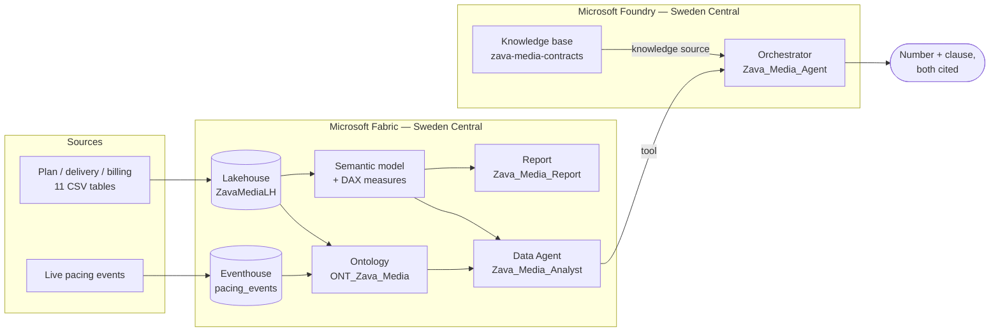

# Zava Media — Fabric IQ × Foundry demo

A media-agency demo built on Microsoft Fabric and Microsoft Foundry.

It answers one question that neither system can answer alone:

> **"Did we over-deliver on Contoso Mobility in Spain in Q3 — and does their contract
> provide for compensation?"**

The first half is a **number**. It is computed in Fabric, in DAX, over a Lakehouse.
The second half is a **clause**. It is retrieved by Foundry from the contract corpus.
The language model routes, cites and phrases. It never computes and never paraphrases
a clause into a rule.

That separation is the point of the demo, not an implementation detail — see
[the boundary rule](#the-boundary-rule) below.

---

## At a glance

| | |
|---|---|
| **Domain** | Media agency — planning, delivery, billing, live pacing |
| **Company** | Zava Media (fictional agency), five fictional advertisers |
| **Fabric items** | Lakehouse · Eventhouse · Ontology (Fabric IQ) · Data Agent · Semantic model · Report |
| **Foundry items** | Project · orchestrator agent · knowledge base over the contracts |
| **Region** | Sweden Central (capacity and Foundry project must match) |
| **Dataset** | 11 tables, ~65 000 rows, deterministic, committed to the repo |
| **Contracts** | 5 French framework contracts with **deliberately divergent** clauses |
| **Runs without a tenant?** | Data generation and tests: yes. Deployment: no. |

---

## The demo question, and why it needs both halves

The dataset carries three delivery gaps. Their **numbers are nearly identical**.
Their **contractual consequences are opposite**.

| Advertiser × market × quarter | Delivery vs plan | Contract | Answer |
|---|---:|---|---|
| Contoso Mobility × Spain × Q3 | **+12.00 %** | ADV-001 art. 6.1–6.2 | Not billable, **and** a make-good credit worth 50 % of the excess media value — due within 45 days, **without the client asking** |
| Litware Retail × UK × Q3 | **+11.00 %** | ADV-004 art. 6.1–6.3 | **Nothing.** Compensation, credit and carry-over are expressly excluded |
| Fabrikam Beauty × Italy × Q3 | **−8.00 %** | ADV-002 art. 6.2 | **A 2 % penalty** on the net media budget, owed by the agency, due without formal notice |

A fourth case needs a genuine anti-join rather than a status flag:

| Finding | Value | Contract | Answer |
|---|---:|---|---|
| Two Litware UK campaigns delivered in 09/2026 with **no invoice row at all** | **649 159 €** | ADV-004 art. 9.2 (120-day billing window) | Still recoverable — **time-barred on 28 January 2027** |

> The generator reports this as **6** and the test asserts **2** — same finding, two
> grains. `fact_billing` is keyed on campaign × media owner × month, so 2 campaign-months
> across 3 media owners means 6 omitted invoice rows.

Neither side alone is useful. The data says *"an invoice is missing."* The contract says
*"you have 120 days."* Only the two together say *"649 k€, deadline 28 January."*

Every percentage above is **exact by construction**, not approximate. The generator
normalises its daily weight vectors so each placement lands precisely on
`planned × ratio`. That matters: in the room, the number has to survive being checked
by hand on a napkin.

---

## The boundary rule

The data world stays on the data side.

- Measures, aggregation logic and entity semantics live in **Fabric** — in the semantic
  model, the ontology, and the Data Agent that queries them.
- **Foundry** orchestrates, retrieves the contractual clause, and writes the answer.
  It **never reimplements a metric**.

The Fabric hop costs latency. That cost is accepted deliberately, because the
alternative — two definitions of "delivered impressions", one in Fabric and one in a
prompt — is worse than slow. It is unauditable.

For a French advertising engagement this is not a design preference, it is the
commercial argument: under the transparency regime governing advertising purchasing
(loi n° 93-122 of 29 January 1993, extended to programmatic), an agency has to be able
to show *how* a figure was produced. A number computed inside a language model cannot
be shown. A number computed in DAX can.

---

## What it demonstrates

1. **A classic BI baseline** — plan vs delivery vs billing across five advertisers,
   five markets, seven channels, two quarters.
2. **Fabric IQ** — one ontology gives *campaign*, *delivery* and *market* a single
   definition, shared by the report, the Data Agent and the graph. Batch facts and the
   real-time pacing stream hang off the **same entity**.
3. **A Fabric Data Agent** — natural-language questions answered in DAX, with the query
   visible.
4. **Foundry orchestration** — an agent that calls the Fabric Data Agent as a *tool* and
   the contract corpus as a *knowledge source*, then reconciles them.
5. **The seam neither product covers** — the contractual consequence of a data finding.

---

## Architecture



Two attachment kinds, and they are not interchangeable:
the **Data Agent is a tool** — the orchestrator delegates the *question* and Fabric
returns an *answer*. The **contract corpus is a knowledge source** — text comes back and
the orchestrator reasons over it. Attaching the ontology as a knowledge source *and* the
Data Agent as a tool is legal, silent, and almost always wrong: nothing in the response
tells you which path answered.

---

## Project layout

```
Fab-Zava-Media/
├── src/
│   ├── config.example.yaml     names, anomalies, reference data — copy to config.yaml
│   └── generate_data.py        deterministic seeded generator (seed 42)
├── data/
│   ├── raw/                    11 generated CSVs — COMMITTED on purpose
│   └── contracts/              5 framework contracts (French, fictional)
├── docs/ARCHITECTURE.md
├── tests/test_smoke.py         the demo storyline, locked mechanically
├── scripts/
├── taskflow/
└── presentation/
```

`src/config.yaml` is gitignored — it carries tenant and capacity GUIDs.

---

## Mandatory testing gate

```bash
python -m pytest tests/ -v --tb=short
```

The suite is not a formality. It asserts the **exact** anomaly percentages
(+12.00 / +11.00 / −8.00), that background noise stays visibly below them, that spend
does *not* move with the over-delivered impressions (otherwise the make-good clause
would be the wrong question), that the unbilled gap is a real anti-join with no status
flag leaking the answer, and that the three contracts still say three different things.

Harmonise the clauses or smooth an anomaly, and the suite fails — which is the intent.
The demo can break while every file still looks fine.

---

## Quick start

```bash
pip install -r requirements.txt
cp src/config.example.yaml src/config.yaml     # then fill capacity_id + tenant_id
python src/generate_data.py                    # regenerates data/raw/ (idempotent)
python -m pytest tests/ -v
```

The generator prints the planted anomalies on completion, so whoever runs the demo knows
the right answers before the agent gives them.

Deployment to Fabric additionally needs a real F-SKU capacity ID and tenant ID in
`src/config.yaml`. Without them, everything above still works offline.

---

## Public-repo hygiene

Written to be publishable. The agency is **Zava Media**; the advertisers are Microsoft's
canonical fictional companies (Contoso, Fabrikam, Northwind, Litware, Adventure Works);
the media owners are invented. Every contract opens with a fictional-document notice, and
a test enforces that notice. No real GUID, endpoint, customer name or account path
appears anywhere.

Verified with the umbrella scanner:

```bash
python ../Azure-Brain/Meta-Brain/tools/scan_public_safety.py .
```

---

## Key facts

| Fact | Value |
|---|---|
| Generator seed | 42 — same input, same bytes |
| Period covered | 2026-04-01 → 2027-03-31 (Q2 + Q3 active) |
| Campaigns | 80 across 5 advertisers, 10 brands, 5 markets |
| Delivery rows | 21 960 daily rows |
| Pacing events | 20 160 hourly rows with a trailing 7-day pacing index |
| Currency | EUR throughout, including the UK market (deliberate simplification) |
| Contract language | French — the client is French, and the contracts are the differentiating asset |
| Code and docs | English |

---

## License

MIT. See [LICENSE](LICENSE).
