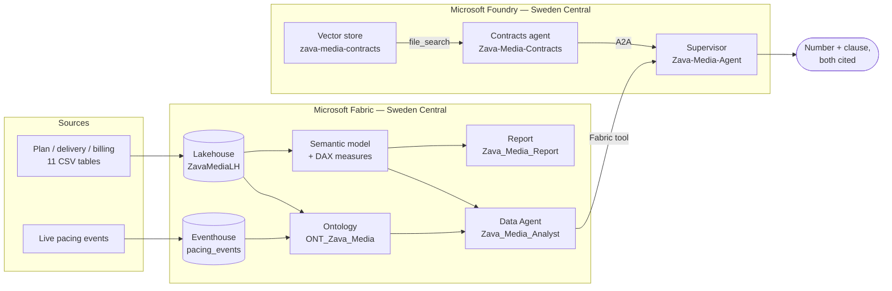

# Zava Media — Fabric IQ × Foundry demo

A media-agency demo built on Microsoft Fabric and Microsoft Foundry.

It answers one question that neither system can answer alone:

> **"Did we over-deliver on Contoso Mobility in Spain in Q3 — and does their contract
> provide for compensation?"**

The first half is a **number**. It is computed in Fabric, in DAX, over a Lakehouse.
The second half is a **clause**. It is retrieved by Foundry from the contract corpus.
The language model routes, cites and phrases. It never computes and never paraphrases
a clause into a rule.

That separation is the point of the demo, not an implementation detail — see
[the boundary rule](#the-boundary-rule) below.

---

## At a glance

| | |
|---|---|
| **Domain** | Media agency — planning, delivery, billing, live pacing |
| **Company** | Zava Media (fictional agency), five fictional advertisers |
| **Fabric items** | Lakehouse · Eventhouse · Ontology (Fabric IQ) · Data Agent · Semantic model · Report |
| **Foundry items** | Project · supervisor agent · contracts agent (A2A) · vector store over the contracts |
| **Region** | Sweden Central (capacity and Foundry project must match) |
| **Dataset** | 11 tables, ~65 000 rows, deterministic, committed to the repo |
| **Contracts** | 5 framework contracts with **deliberately divergent** clauses |
| **Runs without a tenant?** | Data generation and tests: yes. Deployment: no. |

---

## The demo question, and why it needs both halves

The dataset carries three delivery gaps. Their **numbers are nearly identical**.
Their **contractual consequences are opposite**.

| Advertiser × market × quarter | Delivery vs plan | Contract | Answer |
|---|---:|---|---|
| Contoso Mobility × Spain × Q3 | **+12.00 %** | ADV-001 art. 6.1–6.2 | Not billable, **and** a make-good credit worth 50 % of the excess media value — due within 45 days, **without the client asking** |
| Litware Retail × UK × Q3 | **+11.00 %** | ADV-004 art. 6.1–6.3 | **Nothing.** Compensation, credit and carry-over are expressly excluded |
| Fabrikam Beauty × Italy × Q3 | **−8.00 %** | ADV-002 art. 6.2 | **A 2 % penalty** on the net media budget, owed by the agency, due without formal notice |

A fourth case needs a genuine anti-join rather than a status flag:

| Finding | Value | Contract | Answer |
|---|---:|---|---|
| Two Litware UK campaigns delivered in 09/2026 with **no invoice row at all** | **649 159 €** | ADV-004 art. 9.2 (120-day billing window) | Still recoverable — **time-barred on 28 January 2027** |

> The generator reports this as **6** and the test asserts **2** — same finding, two
> grains. `fact_billing` is keyed on campaign × media owner × month, so 2 campaign-months
> across 3 media owners means 6 omitted invoice rows.

Neither side alone is useful. The data says *"an invoice is missing."* The contract says
*"you have 120 days."* Only the two together say *"649 k€, deadline 28 January."*

Every percentage above is **exact by construction**, not approximate. The generator
normalises its daily weight vectors so each placement lands precisely on
`planned × ratio`. That matters: in the room, the number has to survive being checked
by hand on a napkin.

---

## The boundary rule

The data world stays on the data side.

- Measures, aggregation logic and entity semantics live in **Fabric** — in the semantic
  model, the ontology, and the Data Agent that queries them.
- **Foundry** orchestrates, retrieves the contractual clause, and writes the answer.
  It **never reimplements a metric**.

The Fabric hop costs latency. That cost is accepted deliberately, because the
alternative — two definitions of "delivered impressions", one in Fabric and one in a
prompt — is worse than slow. It is unauditable.

For a French advertising engagement this is not a design preference, it is the
commercial argument: under the transparency regime governing advertising purchasing
(loi n° 93-122 of 29 January 1993, extended to programmatic), an agency has to be able
to show *how* a figure was produced. A number computed inside a language model cannot
be shown. A number computed in DAX can.

---

## What it demonstrates

1. **A classic BI baseline** — plan vs delivery vs billing across five advertisers,
   five markets, seven channels, two quarters.
2. **Fabric IQ** — one ontology gives *campaign*, *delivery* and *market* a single
   definition, shared by the report, the Data Agent and the graph. Batch facts and the
   real-time pacing stream hang off the **same entity**.
3. **A Fabric Data Agent** — natural-language questions answered in DAX, with the query
   visible.
4. **Foundry orchestration** — an agent that calls the Fabric Data Agent as a *tool* and
   the contract corpus as a *knowledge source*, then reconciles them.
5. **The seam neither product covers** — the contractual consequence of a data finding.

---

## Architecture



Two attachment kinds, and they are not interchangeable:
the **Data Agent is a tool** — the supervisor delegates the *question* and Fabric
returns an *answer*. The **contract corpus is a knowledge source** — text comes back and
the agent reasons over it. Attaching the ontology as a knowledge source *and* the
Data Agent as a tool is legal, silent, and almost always wrong: nothing in the response
tells you which path answered.

**Why the contracts sit behind their own agent.** The obvious shape puts `file_search` on
the supervisor directly. On a tenant, a supervisor holding a connection-backed tool *and*
`file_search` never calls the connection — it answers everything, numbers included, out of
the documents. `tool_choice="required"` does not rescue it; the model meets the constraint
with the wrong tool. `file_search` describes its own purpose, a connection tool surfaces
only under its name, and the model picks the tool it can read. Pushing the corpus behind
A2A makes both tools opaque, so the routing contract in the prompt is the only thing telling
them apart — which is what it was written to do. Full reasoning in
[ARCHITECTURE § 4](docs/ARCHITECTURE.md).

---

## Project layout

Deployment code is grouped **one folder per Fabric workload**, not flat in a single
`src/`. The rule is that the folder tells you which Fabric artifact the code produces,
so `deploy_ontology.py` sits next to the graph it feeds and nowhere near the report.

| Folder | Theme | Contents |
|---|---|---|
| `fabric/` | Fabric deployment code, one package per workload | `_shared`, `workspace`, `lakehouse`, `ontology`, `graph`, `realtime`, `data_agent`, `powerbi` |
| `foundry/` | Azure AI Foundry — project, connection, agents | ARM + Agents data-plane scripts, `verify_foundry.py` |
| `design/` | Specifications, not deployment | `contracts/` (source corpus), `notebooks/` (offline generator) |
| `artifacts/` | Generated seed data, committed on purpose | `lakehouse_data/` — 11 CSVs |
| `docs/` | Architecture and deploy order | `ARCHITECTURE.md`, `DEPLOYMENT.md` |
| `tests/` | The mechanical gate | 192 tests, run before every deploy |
| `taskflow/` | Workspace canvas | imported by hand, no REST API exists |

```
Fab-Zava-Media/
├── deploy_all.py               one-shot idempotent orchestrator + pre-demo warm-up
├── config.example.yaml         names, anomalies, reference data — copy to config.yaml
├── state.example.json          shape of the GUIDs each deploy step writes back
├── fabric/
│   ├── _shared/
│   │   ├── paths.py            every filesystem location, resolved once
│   │   ├── platform_env.py     PATH repair + UTF-8 stdout; every script bootstraps first
│   │   └── helpers.py          auth, async polling, item lookup, Kusto, OneLake tokens
│   ├── workspace/
│   │   └── deploy_workspace.py       workspace + capacity assignment (region sanity check)
│   ├── lakehouse/
│   │   ├── deploy_lakehouse.py       lakehouse + CSV upload; owns BATCH_TABLES
│   │   ├── deploy_setup_notebook.py  CSV → Delta, calendar columns forced to STRING
│   │   └── notebook_utils.py         notebook definition builder (.py format, never ipynb)
│   ├── ontology/
│   │   └── deploy_ontology.py        7 entities, 9 relationships, 1 TimeSeries binding
│   ├── graph/
│   │   ├── deploy_graph.py           graph population (the ontology does NOT do this)
│   │   └── refresh_graph.py          standalone RefreshGraph job
│   ├── realtime/
│   │   ├── deploy_eventhouse.py      eventhouse, KQL table, streaming ingestion
│   │   └── preload_pacing.py         20 160 pacing rows + count verification
│   ├── data_agent/
│   │   └── deploy_data_agent.py      Zava_Media_Analyst — ontology (GQL) + model (DAX)
│   └── powerbi/
│       ├── deploy_semantic_model.py  Direct Lake model, ~35 DAX measures, Prep for AI
│       ├── deploy_report.py          Zava_Media_Report — 3 pages / 27 visuals, PBIR only
│       └── Zava_Media_Report.Report/ generated PBIR folder — rebuilt from scratch each run
├── foundry/
│   ├── foundry_common.py             ARM + Agents data-plane helpers (two api-versions, one 'v1')
│   ├── deploy_foundry_project.py     RG + AI Services account + project + model deployment
│   ├── deploy_foundry_connection.py  Fabric data agent connection, built from state GUIDs
│   ├── deploy_foundry_agents.py      Zava-Media-Contracts + Zava-Media-Agent, A2A wiring
│   └── verify_foundry.py             three routing probes + the answer contract, post-deploy
├── design/
│   ├── contracts/              5 framework contracts (English, fictional)
│   └── notebooks/
│       └── generate_data.py    deterministic seeded generator (seed 42)
├── artifacts/
│   └── lakehouse_data/         11 generated CSVs — COMMITTED on purpose
├── docs/
│   ├── ARCHITECTURE.md
│   └── DEPLOYMENT.md           deploy order + what each step depends on
├── tests/
│   ├── test_smoke.py           the demo storyline, locked mechanically
│   ├── test_deploy_scripts.py  the seams between the deploy scripts
│   ├── test_foundry_scripts.py the Foundry failures that deploy cleanly
│   ├── test_report.py          the PBIR traps that VALIDATE cleanly
│   └── test_taskflow.py        the task flow schema traps
└── taskflow/
    └── zava_media_taskflow.json  workspace canvas — imported by hand, no REST API exists
```

### How to run a single step

Every folder is a real Python package, so a script is run as a module **from the
repository root**, which is what puts the root on `sys.path`:

```bash
python -m fabric.lakehouse.deploy_lakehouse
python -m foundry.verify_foundry
```

`python fabric/lakehouse/deploy_lakehouse.py` does *not* work, deliberately: the
alternative was a `sys.path` fix-up copy-pasted into all 22 scripts. `deploy_all.py`
lives at the root precisely so `python deploy_all.py` needs no such ceremony.

`config.yaml` and `state.json` are gitignored — they carry tenant, capacity and
item GUIDs. `state.example.json` shows the shape; every ID in it is written by a
`deploy_*.py` step, never by hand.

---

## Mandatory testing gate

```bash
python -m pytest tests/ -v --tb=short
```

**160 tests, no tenant required.** Four files, four different jobs.

`test_smoke.py` guards the **dataset**. It asserts the exact anomaly percentages
(+12.00 / +11.00 / −8.00), that background noise stays visibly below them, that spend
does *not* move with the over-delivered impressions (otherwise the make-good clause
would be the wrong question), that the unbilled gap is a real anti-join with no status
flag leaking the answer, and that the three contracts still say three different things.

`test_deploy_scripts.py` guards the **seams between the deploy scripts** — every failure
it catches would otherwise ship as a deploy that succeeds and is wrong:

- an ontology entity bound to a column that no longer exists in the CSV (→ empty graph,
  no error)
- a DAX measure the data agent tells the LLM to use, that is not in the semantic model
  (→ the model invents plausible, unverifiable DAX)
- a GQL few-shot citing an edge label that was renamed (→ returns nothing, successfully)
- a data agent written to `draft/` only (→ invisible to Foundry, looks deployed)
- a second join path to `dim_advertiser` (→ Power BI silently deactivates one and the
  advertiser-level figure changes)
- KQL columns reordered against the CSV (→ positional ingestion loads campaign IDs into
  the channel column)
- a column or measure whose *name* implies a contractual entitlement — that half of the
  question belongs to Foundry, and the boundary is enforced in the model, not just in a
  prompt

`test_foundry_scripts.py` guards the **Foundry failures that deploy cleanly** — every one
of them produces a green deploy followed by an agent that answers fluently from the wrong
place:

- a `file_search` attached to the supervisor (→ the Fabric tool never fires and the numbers
  come out of a PDF)
- a figure hardcoded in the supervisor prompt (→ an answer that looks sourced and is not)
- the `### SOURCE` marker drifting between the prompt that mandates it and the verifier that
  splits on it (→ a correct answer fails verification and someone "fixes" the agent)
- an A2A connection pointed at the card path instead of the base path (→ created with HTTP
  200, resolves at invoke, never before)
- one protocol written without re-listing the others (→ merge-patch replaces the array and
  silently disables `responses`)
- a date-shaped api-version on the Agents data plane (→ 400, reads as a broken route)
- a GUID hardcoded where a connection name belongs (→ works here, breaks on promotion)

`test_taskflow.py` guards the **one artifact no API validates**. Task flows have no REST
endpoint, so the workspace canvas is imported by hand in front of the customer and the
portal either parses it or says "import failed" with no line number. The guard catches a
non-ASCII character anywhere in the prose (invisible in a diff, fatal to the parser), a BOM,
`taskType` instead of `type`, an edge pointing at an id no task declares (draws nothing,
raises nothing), and an item renamed in `config.example.yaml` but not on the canvas. It also
asserts the two Foundry agents stay *off* the canvas: a task flow maps Fabric items, and
putting them there would imply Fabric owns them.

Harmonise the clauses, smooth an anomaly, or rename a measure on one side of a seam, and
the suite fails — which is the intent. The demo can break while every file still looks fine.

---

## Quick start

```bash
pip install -r requirements.txt
cp config.example.yaml config.yaml     # then fill capacity_id + tenant_id
python -m design.notebooks.generate_data                    # regenerates artifacts/lakehouse_data/ (idempotent)
python -m pytest tests/ -v
```

The generator prints the planted anomalies on completion, so whoever runs the demo knows
the right answers before the agent gives them.

Then deploy — one command, idempotent, resumable, Fabric then Foundry:

```bash
cd src
python deploy_all.py                       # workspace → … → supervisor, then warm up
python deploy_all.py --fabric-only         # Fabric side only — the Foundry half is unproven
python deploy_all.py --from ontology       # resume after a failure
python deploy_all.py --warmup              # right before the demo: pay the cold start off-stage
python -m foundry.verify_foundry                   # prove the routing, don't assume it
```

`verify_foundry.py` is not optional politeness. Every A2A subordinate emits the same call
type, so a type-based check passes happily while the supervisor asks the contract corpus for
a number. It asserts on connection **names**, and on each probe it checks both that the
expected tool fired *and* that the other one did not.

Deployment needs a real F-SKU capacity ID and tenant ID in `config.yaml`. Without
them, everything above still works offline. The full step table and the ordering rules
that are not obvious are in [`docs/ARCHITECTURE.md` § 5](docs/ARCHITECTURE.md).

**Before the first Foundry run:** open each agent alone in the playground, force each tool,
and choose *Always approve this tool*. Approval cannot be completed inside a multi-agent
run — it errors in a way that reads exactly like a routing bug.

---

## Public-repo hygiene

Written to be publishable. The agency is **Zava Media**; the advertisers are Microsoft's
canonical fictional companies (Contoso, Fabrikam, Northwind, Litware, Adventure Works);
the media owners are invented. Every contract opens with a fictional-document notice, and
a test enforces that notice. No real GUID, endpoint, customer name or account path
appears anywhere.

Verified with the umbrella scanner:

```bash
python ../Azure-Brain/Meta-Brain/tools/scan_public_safety.py .
```

---

## Key facts

| Fact | Value |
|---|---|
| Generator seed | 42 — same input, same bytes |
| Period covered | 2026-04-01 → 2027-03-31 (Q2 + Q3 active) |
| Campaigns | 80 across 5 advertisers, 10 brands, 5 markets |
| Delivery rows | 21 960 daily rows |
| Pacing events | 20 160 hourly rows with a trailing 7-day pacing index |
| Currency | EUR throughout, including the UK market (deliberate simplification) |
| Language | English throughout — contracts, code and docs. The French transparency law is cited *in* the contracts (ADV-005) where it belongs, not used as the document language |

---

## License

MIT. See [LICENSE](LICENSE).
