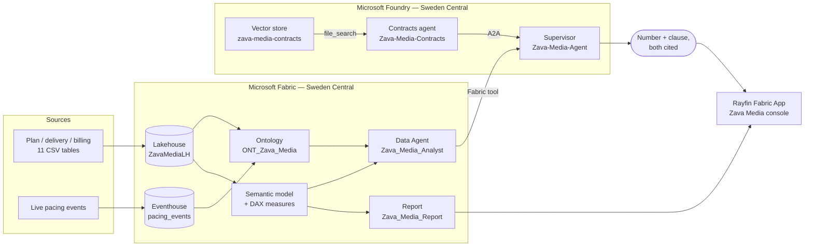

# Zava Media — Fabric IQ × Foundry demo


<!-- HERO VISUAL — drop the teaser video here once the console is done.
     Guideline: video first, then 2-3 captioned screenshots in a ## Screens
     section placed right after this lead. Upload via a GitHub comment to get a
     user-attachments URL; do not commit large media to the repo. -->

A media-agency demo built on Microsoft Fabric and Microsoft Foundry. It answers one
question that neither system can answer alone:

> **"Did we over-deliver on Contoso Mobility in Spain in Q3 — and does their contract
> provide for compensation?"**

The number is computed in Fabric, in DAX, over a Lakehouse. The clause is retrieved by
Foundry from the contract corpus. The language model routes, cites and phrases — it never
computes, and never paraphrases a clause into a rule. That separation is the point of the
demo, not an implementation detail.

> **Synthetic data.** Fictional agency, fictional advertisers. All 11 tables are generated
> from seed 42 by [`design/notebooks/generate_data.py`](design/notebooks/generate_data.py).
> No real customer, GUID or endpoint appears anywhere in this repository.

---

## At a glance

| | |
|---|---|
| **Domain** | Media agency — planning, delivery, billing, live pacing |
| **Company** | Zava Media (fictional agency), five fictional advertisers |
| **Fabric items** | Lakehouse · Eventhouse · Ontology (Fabric IQ) · Data Agent · Semantic model · Report |
| **Foundry items** | Project · supervisor agent · contracts agent (A2A) · vector store over the contracts |
| **Hosted application** | Rayfin Fabric App · React/Vite console · Entra SPA + Fabric-brokered authentication |
| **Region** | Sweden Central (capacity and Foundry project must match) |
| **Dataset** | 11 tables, ~65 000 rows, deterministic, committed to the repo |
| **Contracts** | 5 framework contracts with **deliberately divergent** clauses |
| **Runs without a tenant?** | Data generation and tests: yes. Deployment: no. |

---

## The question the demo answers

The dataset carries three delivery gaps. Their **numbers are nearly identical**.
Their **contractual consequences are opposite**.

| Advertiser × market × quarter | Delivery vs plan | Contract | Answer |
|---|---:|---|---|
| Contoso Mobility × Spain × Q3 | **+12.00 %** | ADV-001 art. 6.1–6.2 | Not billable, **and** a make-good credit worth 50 % of the excess media value — due within 45 days, **without the client asking** |
| Litware Retail × UK × Q3 | **+11.00 %** | ADV-004 art. 6.1–6.3 | **Nothing.** Compensation, credit and carry-over are expressly excluded |
| Fabrikam Beauty × Italy × Q3 | **−8.00 %** | ADV-002 art. 6.2 | **A 2 % penalty** on the net media budget, owed by the agency, due without formal notice |

Neither side alone is useful. The data says *"delivery ran 12 % over plan."* The contract
says *"make-good credit, 50 % of the excess, 45 days."* Only the two together produce an
answer — and, as the table shows, near-identical numbers produce opposite answers.

---

## The boundary rule

The data world stays on the data side.

- Measures, aggregation logic and entity semantics live in **Fabric** — in the semantic
  model, the ontology, and the Data Agent that queries them.
- **Foundry** orchestrates, retrieves the contractual clause, and writes the answer.
  It **never reimplements a metric**.

The Fabric hop costs latency. That cost is accepted deliberately, because the
alternative — two definitions of "delivered impressions", one in Fabric and one in a
prompt — is worse than slow. It is unauditable.

---

## How it fits together



Two attachment kinds, and they are not interchangeable:
the **Data Agent is a tool** — the supervisor delegates the *question* and Fabric
returns an *answer*. The **contract corpus is a knowledge source** — text comes back and
the agent reasons over it. Attaching the ontology as a knowledge source *and* the
Data Agent as a tool is legal, silent, and almost always wrong: nothing in the response
tells you which path answered.

---

## Repository structure

Deployment code is grouped **one folder per Fabric workload**, not flat in a single `src/`.
The folder tells you which Fabric artifact the code produces, so `deploy_ontology.py` sits next
to the graph it feeds and nowhere near the report.

| Path | What lives there |
|---|---|
| `deploy_all.py` | One-shot idempotent orchestrator, plus the pre-demo warm-up |
| `fabric/` | Fabric deployment code, one package per workload — `_shared`, `workspace`, `lakehouse`, `ontology`, `graph`, `realtime`, `data_agent`, `powerbi`, `application` |
| `foundry/` | Microsoft Foundry — project, connection, agents, and the post-deploy routing verifier |
| `app/` | `zava-media-console` — React + Vite console embedding Fabric items (`@microsoft/fabric-embed`, MSAL, Rayfin) |
| `design/` | Specifications, not deployment — `contracts/` (source corpus), `notebooks/` (offline generator) |
| `artifacts/` | Generated seed data, committed on purpose — `lakehouse_data/`, 11 CSVs |
| `docs/` | Architecture, deploy order, console spec, engineering notes |
| `tests/` | The mechanical gate, run before every deploy |
| `taskflow/` | Workspace canvas, imported by hand — no REST API exists |

Regenerate the full file list with `git ls-files` — it is not duplicated here, so it
cannot drift.

---

## Quick start

Offline first — no tenant, no network. Python 3.12, dependencies in
[`requirements.txt`](requirements.txt):

```bash
git clone https://github.com/Statyx/Fab-Zava-Media.git
cd Fab-Zava-Media
pip install -r requirements.txt
python -m design.notebooks.generate_data     # regenerates artifacts/lakehouse_data/
python -m pytest tests/ -q                   # offline regression gate
```

Then deploy — idempotent and resumable. Needs an F-SKU capacity and Foundry resources
in Sweden Central, Node.js 22.12+, and permission to configure an Entra SPA registration
and publish the Rayfin Fabric App in the target workspace:

```bash
cp config.example.yaml config.yaml         # then fill capacity_id + tenant_id
npm --prefix app ci                        # locked application dependencies
python deploy_all.py                       # Fabric → Foundry → application → warm-up
python deploy_all.py --from ontology       # resume after a failure
python deploy_all.py --app-only             # isolated app redeploy, existing backend state
python -m foundry.verify_foundry           # prove the routing, don't assume it
```

The hosted console is a **first-class deployment step**, after `foundry_agents`.
`--fabric-only` and `--foundry-only` remain backend-only: neither publishes the app, and
neither completes a tenant migration. The mutually exclusive `--app-only` filter (or
`application` / `--from application`) rebuilds and publishes against the backend state.
On Windows, use `npm.cmd` if PowerShell blocks the `npm.ps1` launcher.

The application step derives its local target environment from configuration/state,
configures the Entra SPA, explicitly targets Rayfin, and saves the actual hosted
`application_url`. Azure CLI, Rayfin and browser sign-in caches are independent; switching
`az` alone does not migrate the application. Both Entra SPA/MSAL and Rayfin
Fabric-brokered authentication must work in the new tenant. Never place secrets or
tokens in `VITE_*`: those values ship to the browser.

**Validate the hosted app, not just the backend APIs.** Open `application_url` from
`state.json`, sign in to the target tenant, check the embedded items, and exercise the
number-only, contract-only and combined questions through the console. Offline tests
and deployment success are not evidence of a live, browser-validated migration. See
the [deployment runbook](docs/DEPLOYMENT.md) for prerequisites, tenant isolation and
the end-to-end checklist.

Run `python deploy_all.py --warmup` right before the demo, to pay the cold start off-stage.

---

## Documentation

| Document | For |
|---|---|
| [`docs/ARCHITECTURE.md`](docs/ARCHITECTURE.md) | Why the pieces are wired this way |
| [`docs/DEPLOYMENT.md`](docs/DEPLOYMENT.md) | Deploy steps, dependencies, `state.json` |
| [`docs/APP_SPEC.md`](docs/APP_SPEC.md) | The `zava-media-console` specification |
| [`docs/ENGINEERING-NOTES.md`](docs/ENGINEERING-NOTES.md) | Failure modes, dataset detail, the long version of everything above |

---

## License

MIT. See [LICENSE](LICENSE).
